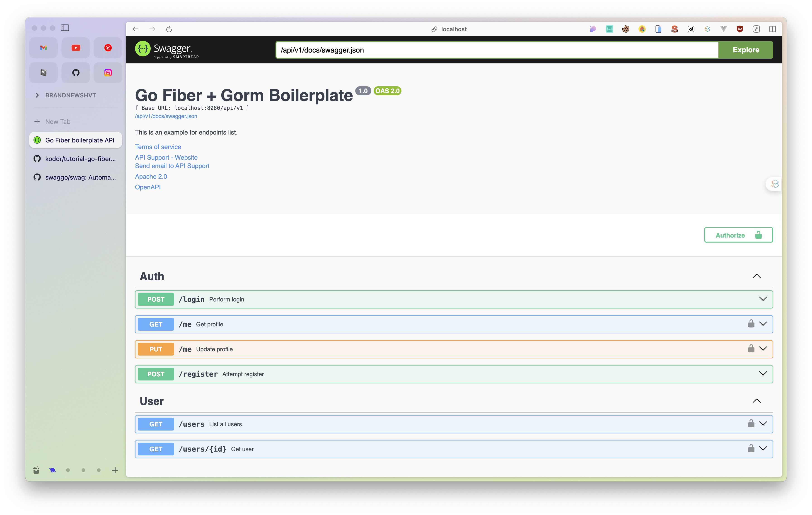

# Go Fiber + Gorm Boilerplate

<p>
  <a href="https://golang.org/doc/go1.21">
    
  </a>
  <a href="https://github.com/gofiber/fiber/releases">
    
  </a>
  <a href="https://opensource.org/licenses/MIT">
    
  </a>
</p>

Is a golang based boilerplate application with Fiber Go web framework and Gorm for database layer.
For any fiber go application, just clone the repo & rename the application name.

[Fiber](https://gofiber.io/) is an Express.js inspired web framework build on top of Fasthttp, the fastest HTTP engine for Go. Designed to ease things up for **fast** development with **zero memory allocation** and **performance** in mind.

## Tools & Libraries used

- [Golang 1.21+](https://golang.org/doc/go1.21)
- [PostgreSQL](https://www.postgresql.org/)
- [Docker](https://www.docker.com/get-started)
- [Fiber](https://github.com/gofiber/fiber)
- [Gorm](https://github.com/go-gorm/gorm)
- [JWT](https://github.com/form3tech-oss/jwt-go)
- [Swagger docs](https://github.com/swaggo/swag)

## ⚡️ Quick start

- Install **`docker`**, **`golang-migrate`** & **`swag`**
- Rename `.env.example` to `.env`
- Run project by this command:

  ```bash
  make docker.run
  ```

- Visit **`http://localhost:5000`** or **`http://localhost:5000/swagger/`**
- Stop `make docker.stop`



## 📦 Used packages

| Name                                                                  | Version   | Type       |
| --------------------------------------------------------------------- | --------- | ---------- |
| [gofiber/fiber](https://github.com/gofiber/fiber)                     | `v2.51.0` | core       |
| [gorm.io/gorm](https://github.com/go-gorm/gorm)                       | `v1.25.17`| database   |
| [gofiber/contrib/jwt](https://github.com/gofiber/contrib/jwt)         | `v1.0.8`  | middleware |
| [arsmn/fiber-swagger](https://github.com/arsmn/fiber-swagger)         | `v2.31.1` | middleware |
| [golang-jwt/jwt/v5](https://github.com/golang-jwt/jwt)                | `v5.2.0`  | auth       |
| [joho/godotenv](https://github.com/joho/godotenv)                     | `v1.5.1`  | config     |
| [swaggo/swag](https://github.com/swaggo/swag)                         | `v1.8.1`  | utils      |
| [go-playground/validator](https://github.com/go-playground/validator) | `v10.17.0`| utils      |

## 🗄 Project structure

### /app

**Folder contains business logic and configurations.**

- `/app/config` folder for configuration functions
- `/app/controllers` folder for functional controller (used in routes)
- `/app/db` folder with database setup functions using Gorm (by default, PostgreSQL)
- `/app/middlewares` folder for add middleware (Fiber built-in and yours)
- `/app/models` folder for describe business models and methods of your project
- `/app/utils` folder contains all helpers function (used in all projects)

### /docs

**Folder with API Documentation.**

This directory contains config files for auto-generated API Docs by Swagger, screenshots
and any other documents related to this project.

### /routes

**Folder with project-specific functionality.** Folder for describe routes of your project

### /tests

**COMING SOON**. Folder contains all test-case for the application

## ⚙️ Configuration

```ini
# .env

# App settings
APP_HOST=localhost
APP_PORT=8080

# Database settings
DB_HOST=localhost
DB_PORT=5432
DB_NAME=go_boilerplate
DB_USER=postgres
DB_PASSWORD=
DB_SSL_MODE=disable

# CORS allowed links
CORS_ALLOWED_ORIGINS=http://localhost:3000

# JWT settings
JWT_SECRET="t3st1234"
```

## 🔨 Docker development

### Coming Soon

## 🔨 Local Development

- Install **`PostgreSQL`** **`golang  >= 1.21`** **`gosec`** & **`swag`**
- Rename `.env.example` to `.env` and fill it with your environment values
- Migrate db & seed some demo data

  ```bash
  make migrate.up
  make seed
  ```

- Run project by this command:

  ```bash
  make run
  ```

- Visit **`http://localhost:5000/api/v1/swagger`** for the API documentation.
- Check `Makefile` for more commands

  ```bash
  # drop migration
  make migrate.down

  # force migration to specific version
  migrate.force

  # run test
  make test
  ...
  ```

## ⚠️ License

[MIT](https://opensource.org/licenses/MIT) &copy; [Adriana Eka Prayudha](https://github.com/radenadri)
